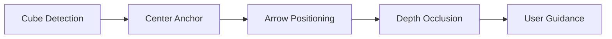

# AR Rubik's Cube Solver 🧩

An advanced Unity AR mobile application that helps users solve Rubik's cubes using computer vision and augmented reality guidance. The app captures cube faces using the device camera, performs real-time cube state analysis, and provides step-by-step AR visual guidance for solving.

## ✨ Features

- **📱 AR Cube Capture**: Capture all 6 faces of your Rubik's cube using AR camera
- **🔍 Computer Vision Processing**: Advanced contour detection and color classification using OpenCV
- **🧮 Intelligent Solving**: Integration with Kociemba algorithm for optimal solve sequences
- **🎯 AR Guidance System**: Real-time AR arrows showing exactly which face to turn
- **📊 Real-time Feedback**: Live cube tracking with depth-based occlusion
- **🎨 Smart Classification**: Robust color detection handling various lighting conditions
- **⚡ Performance Optimized**: Frame skipping and efficient memory management for mobile devices

## 🎮 Supported Platforms

- **iOS**: ARKit-compatible devices (iPhone 6s+ running iOS 11+)
- **Android**: ARCore-compatible devices with OpenGL ES 3.0+
- **Unity Editor**: AR Simulation for development and testing

## 🛠️ Technical Requirements

### Unity Setup
- **Unity Version**: 2022.3.10f1 (LTS)
- **Render Pipeline**: Universal Render Pipeline (URP)
- **Target API Level**: iOS 11+ / Android API 24+
- **Architecture**: ARM64 for mobile deployment

### Hardware Requirements
- **Camera**: Device with rear-facing camera
- **AR Support**: ARKit (iOS) or ARCore (Android) compatibility
- **Performance**: Minimum 2GB RAM, 1GB free storage
- **Lighting**: Good lighting conditions for optimal cube detection

## 📦 Key Dependencies & Packages

### Unity Packages
```json
{
  "com.unity.xr.arfoundation": "5.1.4",
  "com.unity.xr.arcore": "5.1.4", 
  "com.unity.xr.arkit": "5.1.4",
  "com.unity.xr.interaction.toolkit": "3.0.4",
  "com.unity.render-pipelines.universal": "14.0.8",
  "com.unity.textmeshpro": "3.0.6"
}
```

### Third-Party Integrations
- **[OpenCV for Unity](https://enoxsoftware.com/opencvforunity/)**: Computer vision and image processing
  - Version: Latest compatible with Unity 2022.3.10f1
  - Location: `Assets/OpenCVForUnity/`
  - Used for: Contour detection, image processing, color analysis

- **[Kociemba Algorithm](https://github.com/muodov/kociemba)** (C# Port): Rubik's cube solving algorithm
  - Location: `Assets/Scripts/Kociemba/`
  - Used for: Optimal cube solve sequence generation
  - Features: Two-phase algorithm, runtime table building

### Asset Packages
- **Animation Textures**: Custom arrow animations and materials (`Assets/Animation_Textures/`)
- **Mobile AR Template Assets**: Unity AR Foundation templates and shaders
- **UI Pack**: Interface assets and fonts from Kenney.nl

## 🏗️ Project Structure

```
Assets/
├── 📁 Scripts/
│   ├── CubeCaptureController.cs      # Main capture workflow
│   ├── CubeProcessor.cs              # OpenCV computer vision
│   ├── CubeSolverController.cs       # Solution navigation
│   ├── CaptureGuide.cs               # AR tracking & guidance
│   ├── CubeClassifier.cs             # Color classification
│   └── 📁 Kociemba/                  # Cube solving algorithm
├── 📁 Scenes/
│   ├── CubeCapture.unity             # Main AR capture scene
│   ├── CubeSolve.unity               # AR guidance scene
│   └── Menu.unity                    # App menu
├── 📁 OpenCVForUnity/                # Computer vision library
├── 📁 Animation_Textures/            # AR arrow assets
├── 📁 MobileARTemplateAssets/        # AR Foundation templates
└── 📁 Prefabs/                       # Reusable game objects
```

## 🚀 Installation & Setup

### 1. Clone Repository
```bash
git clone [repository-url]
cd CubeSolver
```

### 2. Open in Unity
1. Launch Unity Hub
2. Click "Open" → Navigate to project folder
3. Unity will automatically import packages and dependencies

### 3. Platform Configuration

#### For iOS Development:
1. **Build Settings** → Switch platform to iOS
2. **Player Settings** → Set bundle identifier
3. **XR Plug-in Management** → Enable ARKit
4. Requires Xcode for final deployment

#### For Android Development:
1. **Build Settings** → Switch platform to Android
2. **Player Settings** → Set package name and keystore
3. **XR Plug-in Management** → Enable ARCore
4. Install Android SDK and NDK

### 4. OpenCV Setup
1. OpenCV for Unity should auto-import from `Assets/OpenCVForUnity/`
2. If issues occur, use **Tools → OpenCV for Unity → Set Plugin Import Settings**

## 📱 Usage Instructions

### Cube Capture Workflow
1. **Launch App** → Select "Start Scanning"
2. **Face Sequence**: Follow prompts to capture 6 faces in order:
   - **U** (Up/Top) → **R** (Right) → **F** (Front) → **D** (Down/Bottom) → **L** (Left) → **B** (Back)
3. **Positioning**: Align cube with on-screen grid overlay
4. **Capture**: Tap capture button when cube is stable and well-lit
5. **Auto-Validation**: App automatically processes each face (9 stickers required)

### AR Solution Guidance
1. **After Capture**: App automatically calculates solve sequence
2. **AR Arrows**: Follow animated arrows indicating which face to turn
3. **Step Navigation**: Use Previous/Next buttons to review moves
4. **Rotation Indicators**: Arrow direction shows clockwise/counterclockwise rotation

## 🏛️ Architecture Overview

### Core Components

#### `CubeCaptureController.cs`
- Manages 6-face capture sequence
- Handles image processing workflow
- Integrates with OpenCV and Kociemba solver
- Provides user feedback and error handling

#### `CubeProcessor.cs`
- OpenCV integration for computer vision
- Contour detection and filtering
- 3x3 grid identification and validation
- Color extraction in LAB color space

#### `CubeClassifier.cs`
- Machine learning-based color classification
- Handles lighting variation and color consistency
- Generates standard cube notation string

#### `CubeSolverController.cs`
- Solution step navigation and display
- Integration with AR guidance system
- Move validation and progress tracking

#### `CaptureGuide.cs`
- Real-time AR cube tracking
- AR arrow positioning and animation
- Depth-based occlusion system
- Billboard rotation for camera-facing guidance

### AR Guidance System


## 💡 Development Notes

### Memory Management
- **Texture Cleanup**: All `Texture2D` objects are properly disposed
- **OpenCV Mats**: Explicit `.Dispose()` calls prevent memory leaks
- **Native Arrays**: AR Foundation native arrays use `using` statements

### Performance Optimization
- **Frame Skipping**: Process every 3rd frame for performance
- **Reusable Objects**: Single `CubeProcessor` instance
- **Efficient Contours**: Area-based filtering reduces processing overhead

### Testing Considerations
- **Physical Device Testing**: AR functionality requires real hardware
- **Lighting Conditions**: Test with various lighting scenarios
- **Cube Variations**: Different cube brands and colors
- **Camera Angles**: Various positioning and orientation tests

## 🐛 Troubleshooting

### Common Issues

#### "Camera not ready" Error
- **Cause**: AR Foundation not initialized
- **Solution**: Ensure device has AR support, check permissions

#### "Only X stickers detected" Message
- **Cause**: Poor lighting or cube visibility
- **Solution**: Improve lighting, ensure cube fills grid overlay

#### AR Arrows Not Appearing
- **Cause**: Missing animatedArrowPrefab assignment
- **Solution**: Drag arrow prefab to CaptureGuide component

#### Classification Errors
- **Cause**: Inconsistent lighting or damaged cube stickers
- **Solution**: Use consistent lighting, avoid reflective surfaces

### Debug Features
- Enable debug logs with prefix tags: `[CubeCaptureController]`, `[CubeProcessor]`
- AR Simulation available in Unity Editor for testing
- OpenCV debug visualization for contour detection

## 🎨 Customization

### Adding New Arrow Animations
1. Create new animated prefab in `Animation_Textures/Prefabs/`
2. Assign to `animatedArrowPrefab` in CaptureGuide
3. Configure materials with proper render queue (≥3000)

### Modifying Color Classification
- Adjust thresholds in `CubeClassifier.cs`
- Test with various cube brands and lighting conditions
- Consider LAB color space calibration

## 📄 License & Credits

### Third-Party Acknowledgments
- **OpenCV**: BSD License - Computer vision library
- **Kociemba Algorithm**: Original algorithm by Herbert Kociemba
- **Unity AR Foundation**: Unity Technologies AR framework
- **Kenney UI Pack**: Creative Commons licensed UI assets
- **Animation Textures**: Custom arrow animations and materials

### Development
Built with Unity 2022.3.10f1 and AR Foundation 5.1.4 for modern mobile AR experiences.

---

**🤝 Contributing**: Contributions welcome! Please follow standard Unity development practices and include comprehensive testing for AR functionality.

**📧 Support**: For technical issues, please check the troubleshooting section or submit detailed bug reports with device specifications and Unity console logs.